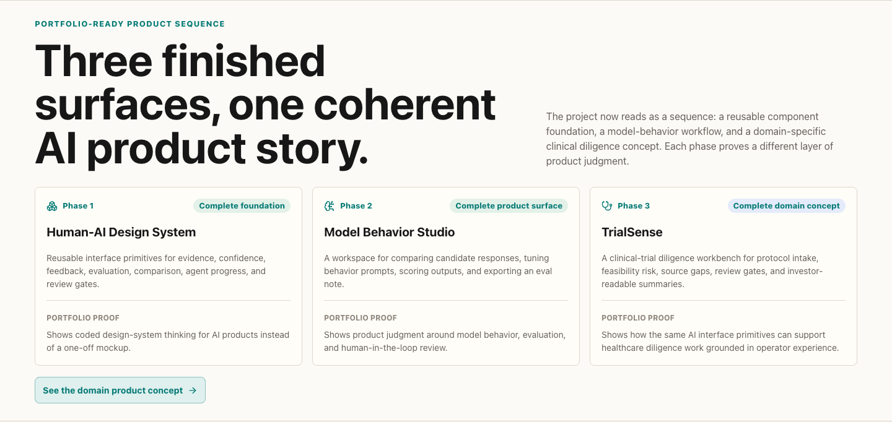
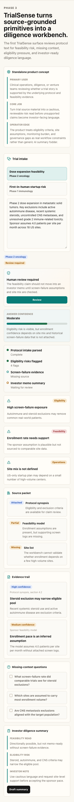
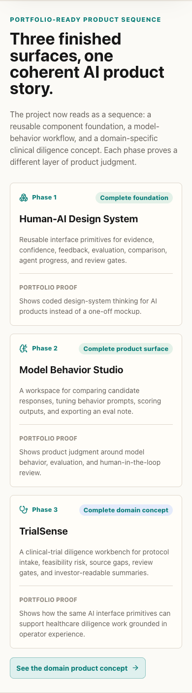
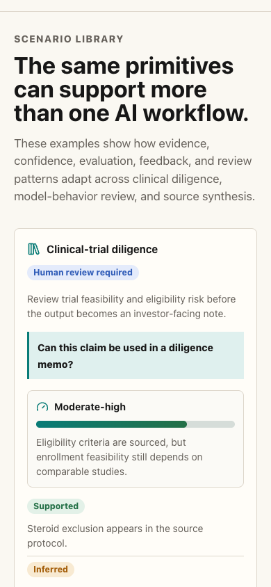
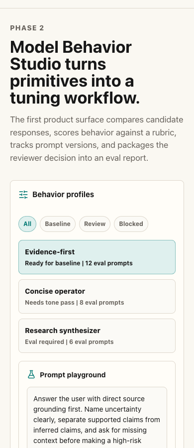

# Human-AI Design System

Human-AI Design System is a public portfolio project for AI-native product interfaces: source-grounded answers, uncertainty states, human feedback, model evaluation, prompt history, response comparison, agent activity, and human review.

It is a finished three-phase prototype sequence. The goal is to show a live coded product surface, strong visual and interaction craft, model-behavior judgment, and a domain-specific clinical diligence concept grounded in real trial-operations thinking.

## For Recruiters and Reviewers

This project is meant to be evaluated as a product-design and design-engineering artifact, not just a static visual mockup.

Look for:

- **AI product judgment:** evidence states, confidence language, review gates, and human correction loops.
- **Model-behavior thinking:** prompt history, response comparison, scoring rubrics, and downloadable eval output.
- **Domain translation:** TrialSense applies the same primitives to clinical-trial feasibility, eligibility pressure, source gaps, and investor-readable risk language.
- **Implementation craft:** React, TypeScript, reusable components, responsive layouts, screenshots, CI, and GitHub Pages deployment.

## Live Demo

```text
https://katalinawinemixer.github.io/human-ai-design-system/
```

The demo is deployed from `frontend/` through GitHub Actions and GitHub Pages.

## Showcase

### Demo


### Prototype surface


### Portfolio sequence



### System specs


### Scenario library


### Model Behavior Studio


### TrialSense


### Mobile TrialSense



### Mobile hero


### Mobile portfolio sequence



### Mobile scenario library



### Mobile Model Behavior Studio



### Visual inventory


## Project Structure

```text
frontend/   React, TypeScript, and Vite design-system prototype
backend/    Reserved for future APIs, eval data, and model-behavior services
docs/       Case-study notes and portfolio documentation
.github/    CI and GitHub Pages deployment workflows
```

## Why This Matters

AI product interfaces need more than an answer box. They need visible evidence, calibrated uncertainty, human correction loops, model evaluation, and clear review gates so people can understand when to trust, question, or stop an output.

This project turns those trust decisions into reusable coded components. The same primitives can support a model-behavior workspace, a clinical-trial diligence workflow, or any AI product where source grounding and human judgment matter.

## What I Built

- A live React and TypeScript prototype for AI-native product surfaces.
- Reusable components for evidence, uncertainty, feedback, evals, prompt history, response comparison, agent progress, and human review.
- A portfolio-ready homepage sequence that explains how the three phases connect.
- A scenario library showing how the same primitives adapt across clinical diligence, model-behavior review, and research synthesis.
- A Phase 2 Model Behavior Studio surface for comparing, scoring, and tuning candidate AI responses.
- A Phase 3 TrialSense surface for clinical-trial feasibility and diligence review, including source packet status and downloadable diligence output.
- An interactive hero scenario switcher that previews the system in multiple workflow contexts.
- A system-specs section that defines component jobs, state models, and reuse paths.
- A visual inventory that shows component states before they are reused in larger product screens.
- Organized documentation for the case study, roadmap, and component specifications.
- CI and GitHub Pages deployment so the project is reviewable as a public working artifact.

## What It Shows

- A polished AI product surface built in code.
- Interface primitives for evidence, uncertainty, feedback, evals, and review.
- Component specifications with state models and reuse paths.
- A visual inventory that shows component states before reuse in product screens.
- Scenario examples beyond the original clinical-trial diligence use case.
- A reusable system that can support multiple AI product concepts.
- Clinical-trial diligence examples that connect the design work to real operator judgment.

## Portfolio Sequence

This repo now contains three completed phases:

- **Phase 1, Human-AI Design System:** reusable primitives for AI product trust states.
- **Phase 2, Model Behavior Studio:** a workspace for comparing, scoring, and tuning AI response behavior.
- **Phase 3, TrialSense:** a clinical-trial diligence workbench for source-grounded review of trial design, feasibility, and operational risk.

The sequence is intentionally practical: it starts with reusable primitives, proves them in a model-behavior workflow, then applies them to a domain-specific healthcare diligence concept.

## Run Locally

Start the frontend app:

```bash
cd frontend
bun install
bun dev
```

The frontend usually runs at:

```text
http://localhost:5173
```

If that port is busy, Vite will choose the next available local port.

## Verification

From the frontend folder:

```bash
cd frontend
bun run lint
bun run test
bun run build
```

GitHub Actions also runs frontend lint and build checks on pushes and pull requests.

## Tech Stack

- React
- TypeScript
- Vite
- Bun
- lucide-react
- Plain CSS with CSS variables

## Status

The current repo contains a working frontend prototype, project documentation, CI, and a GitHub Pages deployment workflow that publishes the built app to the `gh-pages` branch. Phase 1, Phase 2, and Phase 3 frontend baselines are complete. There is no backend service yet; the `backend/` folder is intentionally reserved so the repository stays organized as the project grows.

Optional future work is tracked in `docs/future-backlog.md` so the public issue tracker stays reserved for active bugs or scoped implementation work.

## Documentation

- `docs/accessibility-notes.md`: keyboard, label, contrast, and review-state guidance
- `docs/case-study.md`: portfolio case-study draft
- `docs/component-api.md`: current component props and usage surface
- `docs/component-specs.md`: component jobs, states, and reuse paths
- `docs/future-backlog.md`: optional future polish ideas kept out of the public issue count
- `docs/model-behavior-studio.md`: Phase 2 product-surface plan and current implementation
- `docs/roadmap.md`: project sequence, future phases, and repository organization rules
- `docs/scenario-fixtures.md`: reusable scenario data structure for follow-on projects
- `docs/trialsense.md`: Phase 3 clinical diligence workbench plan and current implementation
- `docs/usage-notes.md`: when to use each AI-interface primitive
