# Human-AI Design System

A React prototype of reusable UI patterns for AI products: citations, confidence, feedback, evals, prompt history, response comparison, agent activity, and human review.

The repo includes a component gallery, a model-behavior review workspace, and a clinical-trial diligence workbench that reuse the same interaction patterns in different contexts.

## Live Demo

```text
https://katalinawinemixer.github.io/human-ai-design-system/
```

The demo is deployed from `frontend/` through GitHub Actions and GitHub Pages.

## Implemented Patterns

- Evidence states that show where an AI answer came from.
- Confidence and uncertainty patterns that make risk visible.
- Human feedback controls for correcting, approving, or escalating an output.
- Prompt history and response comparison views for reviewing model behavior.
- Eval scorecards and downloadable review output.
- Agent activity timelines that show progress without hiding work.
- Pauseable state-motion examples for review, waiting, caution, and blocked output states.
- Clinical-trial diligence screens grounded in feasibility, eligibility, source gaps, and operational risk.

## What's Included

- `Human-AI Design System`: reusable components for trust, review, evidence, and evaluation states.
- `Model Behavior Studio`: an example workspace for comparing, scoring, and tuning candidate AI responses.
- `TrialSense`: an example clinical-trial diligence workbench for reviewing trial design, feasibility, and source support.
- A task-based get-started path, persistent section navigation, and resource links into the project docs.
- A scenario library showing the same patterns across clinical diligence, model-behavior review, and research synthesis.
- A component catalog with jobs, states, reuse paths, specs, usage notes, accessibility notes, and current implementation docs.
- CI and GitHub Pages deployment so the project can be reviewed as a working frontend prototype.

## Screenshots

### Demo

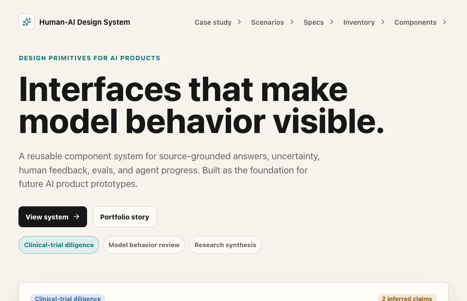

### Main Interface

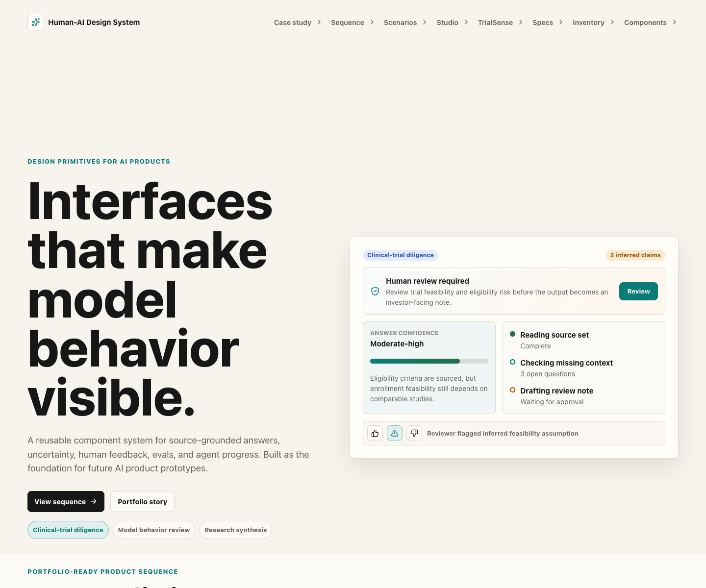

### Get Started

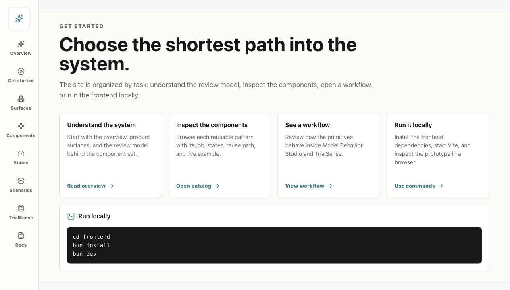

### Product Surfaces


### Component Catalog

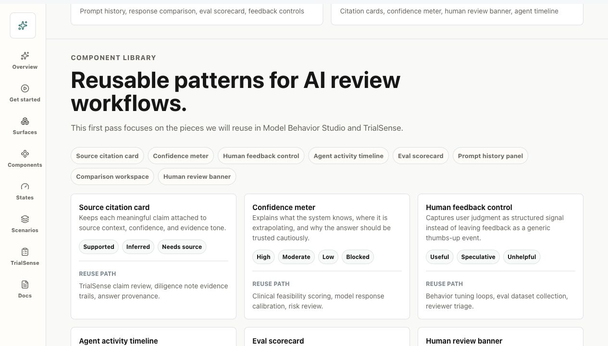

### States and Motion

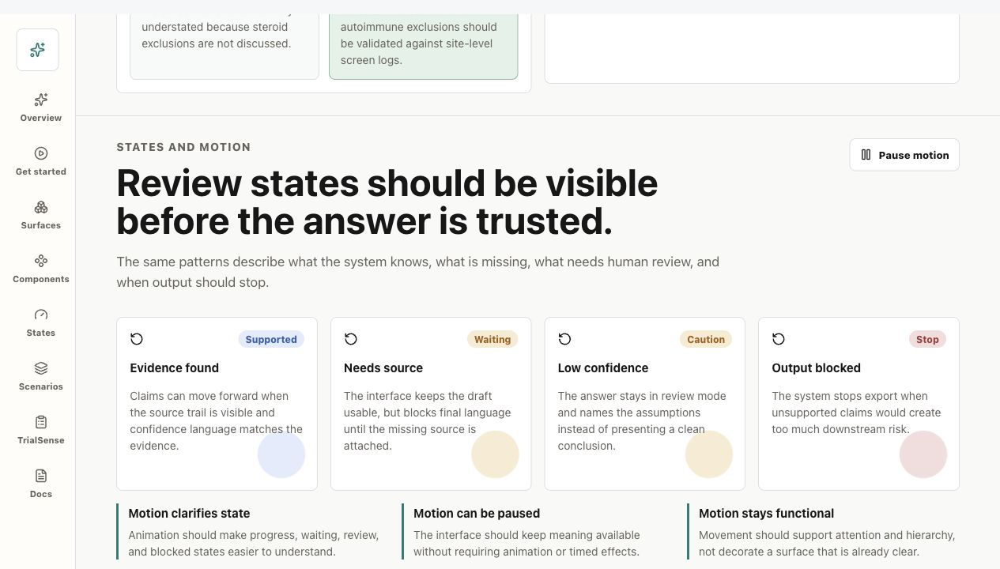

### Component Specs

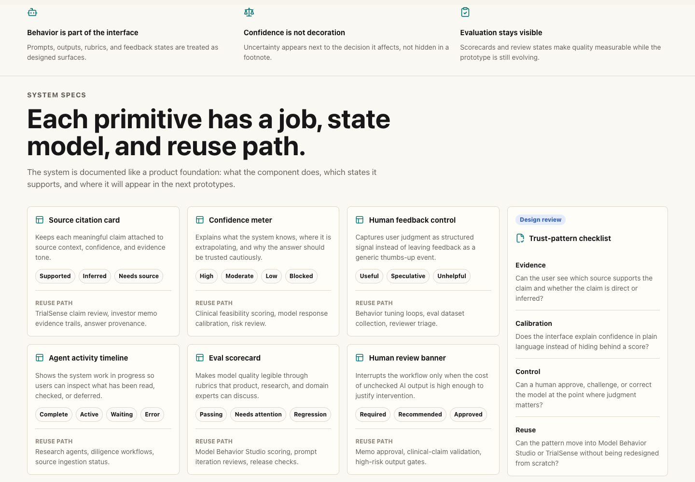

### Scenario Library

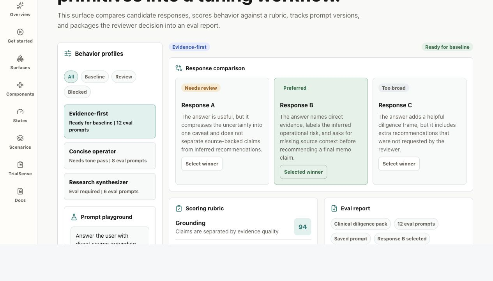

### Model Behavior Studio

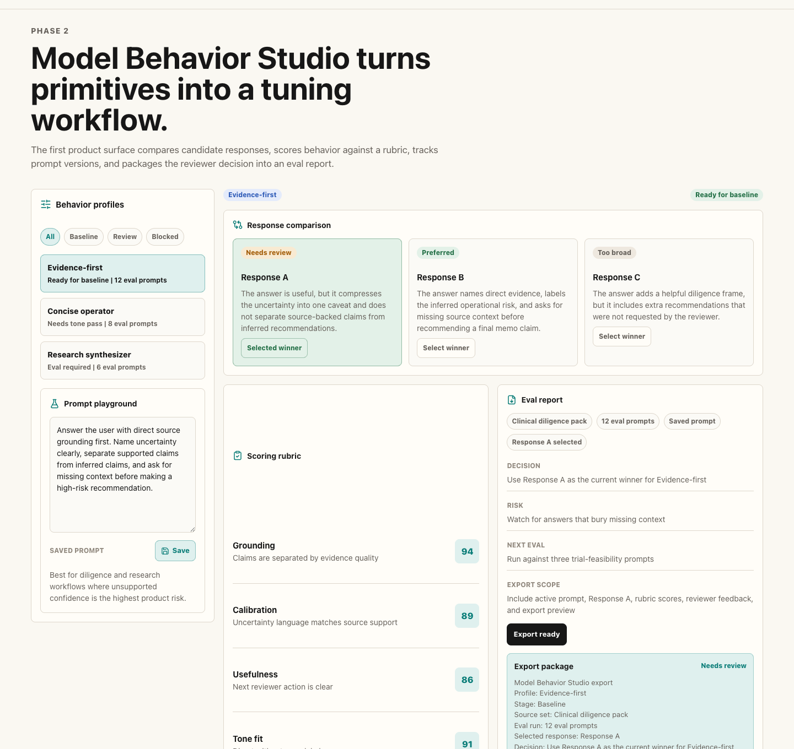

### TrialSense

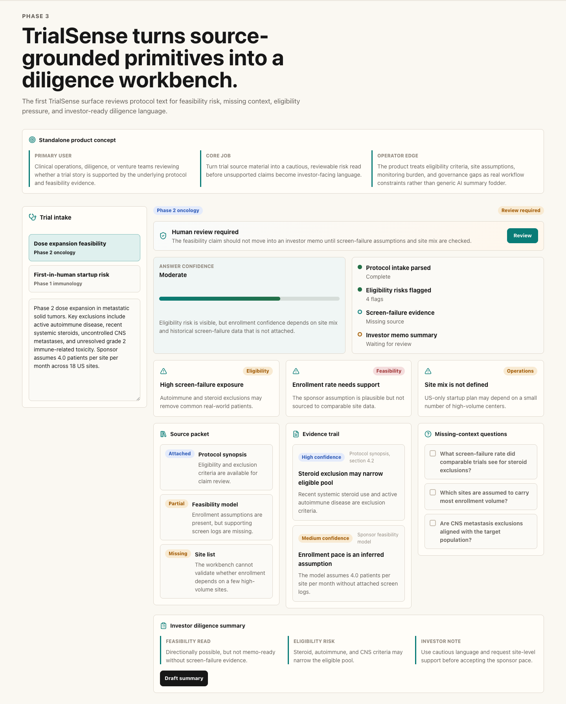

### Visual Inventory

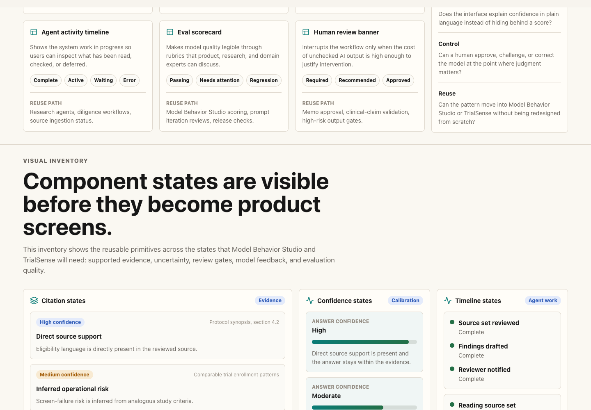

### Mobile Views

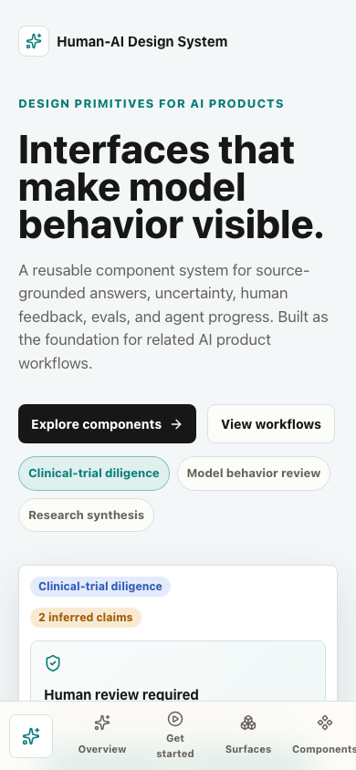

## Project Structure

```text
frontend/   React, TypeScript, and Vite frontend prototype
backend/    Reserved for future APIs, eval data, and model-behavior services
docs/       Case-study notes and implementation documentation
.github/    CI and GitHub Pages deployment workflows
```

## Run Locally

Start the frontend app:

```bash
cd frontend
bun install
bun dev
```

The frontend usually runs at:

```text
http://localhost:5173
```

If that port is busy, Vite will choose the next available local port.

## Verification

From the repository root:

```bash
cd frontend
bun run lint
bun run test
bun run build
```

If your terminal is already inside `frontend/`, skip `cd frontend`.

GitHub Actions also runs frontend lint and build checks on pushes and pull requests.

## Tech Stack

- React
- TypeScript
- Vite
- Bun
- lucide-react
- Plain CSS with CSS variables

## Status

This is a working frontend prototype with static fixtures and local UI state. There is no backend service yet; `backend/` is reserved for future APIs, eval data, and model-behavior services.

Optional future work is tracked in `docs/future-backlog.md` so the public issue tracker stays reserved for active bugs or scoped implementation work.

## Documentation

- `docs/accessibility-notes.md`: keyboard, label, contrast, and review-state guidance
- `docs/case-study.md`: case-study draft
- `docs/component-api.md`: current component props and usage surface
- `docs/component-specs.md`: component jobs, states, and reuse paths
- `docs/future-backlog.md`: optional future polish ideas kept out of the public issue count
- `docs/model-behavior-studio.md`: Model Behavior Studio plan and current implementation
- `docs/roadmap.md`: project sequence and repository organization rules
- `docs/scenario-fixtures.md`: reusable scenario data structure
- `docs/trialsense.md`: TrialSense plan and current implementation
- `docs/usage-notes.md`: when to use each AI-interface primitive
